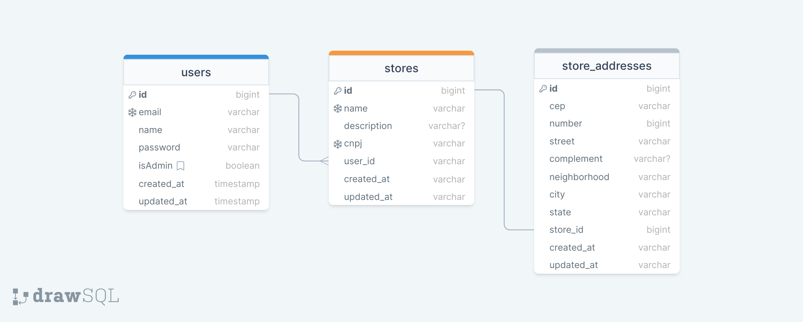

# Agility Labs - Teste Desenvolvedor Backend

Api para gerenciamento de imóveis, onde os usuários podem criar, cadastrar, atualizar, excluir e listar lojas. A aplicação oferece recursos de validação de endereço usando a API ViaCEP e também validação de e-mail do usuário.

A integração com a API ViaCEP garante a precisão e a validade dos endereços fornecidos. Além disso, a validação de e-mail ajuda a manter a integridade dos dados e a garantir a autenticidade dos usuários.

## Sumário

1. [Estrutuda do Projeto](#estrutuda-do-projeto)

2. [Tecnologias Utilizadas](#tecnologias-utilizadas)

3. [Funcionalidades](#funcionalidades)

4. [Estrutura do Banco de Dados](#estrutura-do-banco-de-dados)

5. [Pré-requisitos](#pré-requisitos)

6. [Instalação e Configuração](#instalação-e-configuração)

    - [Configuração normal](#configuração)

    - [Docker](#configuração-com-docker)

7. [Rotas e uso](#rotas-e-uso)

8. [Obervações](#obervações)

9. [Contribuição](#contribuição)

## Estrutuda do Projeto

A estrutura adotada segue o padrão MVC (Model-View-Controller) que é o padrão de arquitetura de software amplamente utilizado no Laravel. Essa estrutura promove a separação clara de responsabilidades entre as camadas de modelo, visualização e controle.

O projeto foi organizado em módulos, seguindo uma abordagem de separação por casos de uso. Cada caso de uso é implementado em um conjunto de classes relacionadas, como controladores, modelos, serviços e validações, etc. Essa organização modular ajuda a manter o código limpo, escalável e de fácil manutenção.

### Tecnologias Utilizadas

- [Laravel 10](https://laravel.com/)

- [Laravel Sanctum](https://laravel.com/docs/10.x/sanctum)

- [Docker e Docker composer](https://www.docker.com/)

- [PHP 8.2](https://www.php.net/)

- [MySQL](https://www.mysql.com/)

- [Insomnia](https://insomnia.rest/) (para testes das rotas)

- [Mailtrap](https://mailtrap.io/) (para testes de envio de email)

- [Drawsql](https://drawsql.app/) (para "desenhar" banco de dados)

### Funcionalidades

- Criação de Usuários.

- Autenticação de Usuários.

- Validação de email de Usuários.

- Login e Logout.

- Criação, edição e exclusão de lojas.

- Verificação de permissão antes de excluir ou editar lojas.

- Listagem de todas as lojas cadastradas e listagem de lojas pertencentes ao usuário.

### Estrutura do Banco de Dados



---

### Pré-requisitos

- [PHP 8.2](https://www.php.net/) (versão ^8.1) - O Laravel requer a versão 8.1 ou superior. Você pode verificar a versão do PHP executando o comando php -v no terminal.

- [Composer](https://getcomposer.org/) (versão 2.5.8) - O Composer é uma ferramenta de gerenciamento de dependências para PHP.

- Banco de Dados - Para este projeto foi escolhido o mysql. O Laravel suporta vários bancos de dados, como MySQL, PostgreSQL, SQLite e SQL Server.

  - [MySQL](https://www.mysql.com/) (versão ^8.0) - Instale o MySQL (não é nescessário caso use Docker). Você pode baixar a versão adequada para o seu sistema operacional no site oficial do MySQL.

### Instalação e Configuração

- [Configuração normal](#configuração)

- [Docker](#configuração-com-docker)

Obs: Caso utilize **docker** siga para o passo a passo de configuração com [Docker](#configuração-com-docker). Caso contrário, siga a [configuração](#configuração) normal da aplicação abaixo.

---

### Configuração

1. Clone o repositório.

```bash
git clone https://github.com/mauricioccardoso/agility-labs.git
```

2. Acesse o diretório do projeto e abra o projeto na sua IDE ou editor de texto.

```bash
cd agility-labs
```

3. Na pasta "backend", copiar o arquivo ".env.example" e renomear para ".env".

4. Alterar a configuração do banco de dados do arquivo ".env" para as configurações do banco de dados instalado na sua máquina.
    - **Importante que você crie um DataBase na sua ferramenta de banco de dados**.
    - Exemplo do mysql:

```bash
# Normal DataBase Configuration

DB_CONNECTION=mysql
DB_HOST=127.0.0.1
DB_PORT=3306
DB_DATABASE=agilityDatabase
DB_USERNAME=root
DB_PASSWORD=mypassword
```

5. Configurar as variáveis de email, conforme seu sistema de email. Exemplo:

```bash
# Email configs

MAIL_MAILER=mailer
MAIL_HOST=host
MAIL_PORT=0000
MAIL_USERNAME=username
MAIL_PASSWORD=mypassword
MAIL_ENCRYPTION=tsl
MAIL_FROM_ADDRESS="my.email@mail.com"

MAIL_FROM_NAME="${APP_NAME}"
```

6. Utilizar o comando abaixo para fazer a intalação das dependências do laravel.

```bash
composer install
```

7. Caso o laravel não gere um chave, usar o comando para gerar uma nova chave de criptografia

```bash
php artisan key:generate
```

8. Executar o comando para criar tabelas

```bash
php artisan migrate
```

9. Utilizar um servidor para disponibilizar a aplicação.
    - Dica: Utilizar o comando "php artisan serve --host=localhost --port=8080".

---

### Configuração com docker

1. Clone o repositório.

```bash
git clone https://github.com/mauricioccardoso/agility-labs.git
```

2. Acesse o diretório do projeto e abra o projeto na sua IDE ou editor de texto.

```bash
cd agility-labs
```

3. Na pasta "backend", copiar o arquivo ".env.example" e renomear para ".env".

4. Descomentar o código e definir o "username" e "password" conforme a configuração no arquivo docker-compose.yaml

```bash
# Docker Database Configuration

DB_CONNECTION=mysql
DB_HOST=db-agility-mysql
DB_PORT=3306
DB_DATABASE=agility
DB_USERNAME=agilityTest                  # Set a user equal to the one configured in the docker-compose.yaml file
DB_PASSWORD=mypassword                  # Set a password equal to the one configured in the docker-compose.yaml file
```

5. Configurar as variáveis de email, conforme seu sistema de email. Exemplo:

```bash
# Email configs

MAIL_MAILER=mailer
MAIL_HOST=host
MAIL_PORT=0000
MAIL_USERNAME=username
MAIL_PASSWORD=mypassword
MAIL_ENCRYPTION=tsl
MAIL_FROM_ADDRESS="my.email@mail.com"

MAIL_FROM_NAME="${APP_NAME}"
```

6. Na raiz do projeto. Utilizar o comando abaixo para subir o container do docker e aguardar a finalização.

```bash
docker compose up -d
```

7. Verificar se o container e servidor estão funcionando.

    Server Status - [http://localhost:8081/](http://localhost:8081/)

---

### Rotas e Uso

A API oferece várias rotas para interagir com os dados das Lojas. A seguir, estão detalhadas as informações sobre cada rota, sua estrutura e exemplos de uso.

1. Verificação do status do servidor

    - Rota: ***GET*** /

2. Criação de usuário

    - Rota: ***POST*** /api/users

    - Headers:

        - Content-Type: application/json

        - Accept: application/json

    - Corpo da requisição

    ```bash
    {
        "name": "User Test",
        "email": "user.test@mail.com",
        "password": "Abc1234",
        "password_confirmation": "Abc1234"
    }
    ```

    - Resposta de sucesso

    ```bash
    {
        "user": {
            "name": "User Test",
            "email": "user.test@mail.com",
            "updated_at": "2023-07-14T00:34:49.000000Z",
            "created_at": "2023-07-14T00:34:49.000000Z",
            "id": 1
        },
        "message": "Please check your email to confirm that this email address belongs to you."
    }
    ```

3. Realização de login de usuário

    - Rota: ***POST*** /api/login

    - Headers:

        - Content-Type: application/json

        - Accept: application/json

    - Corpo da requisição

    ```bash
    {
        "email": "user.test@mail.com",
        "password": "Abc1234"
    }
    ```

    - Resposta de sucesso

    ```bash
    {
        "user": {
            "id": 1,
            "name": "User Test",
            "email": "<user.test@mail.com>",
            "isAdmin": 0,
            "created_at": "2023-07-14T00:34:49.000000Z",
            "updated_at": "2023-07-14T00:34:49.000000Z"
        },
        "token": "1|1234abcdWoQx4w8Ft5zERd12146IkRUw3XhrqllR"
    }
    ```

4. Realização de logout do usuário

    - Rota: ***POST*** /api/logout

    - Headers:

        - Authorization: Bearer {token}

        - Accept: application/json

    - Corpo da requisição

    ```bash
    {
        "email": "user.test@mail.com",
        "password": "Abc1234"
    }
    ```

    - Resposta de sucesso

    ```bash
    {
        "message": "Logout successful."
    }
    ```

5. Reenvio de Email de validação

    - Rota: ***GET*** /api/email/resend-verification-notification

    - Headers:

        - Authorization: Bearer {token}

        - Accept: application/json

    - Resposta de sucesso

    ```bash
    {
        "message": "Email resent."
    }
    ```

6. Criação de uma loja

    - Rota: ***POST*** /api/stores

    - Headers:

        - Authorization: Bearer {token}

        - Content-Type: application/json

        - Accept: application/json

    - Corpo da requisição

        ```bash
        {
            "name": "Empresa Sem Descrição e sem complemento de endereço",
            "cnpj": "00.000.000/0000-01",
            "store_address": {
                "cep": "01001-000",
                "number": 1000,
                "street": "Praça da Sé",
                "neighborhood": "Sé",
                "city": "São Paulo",
                "state": "SP"
            }
        }
        ```

    - Resposta de sucesso

        ```bash
        {
            "id": 1,
            "name": "Empresa Sem Descrição e sem complemento de endereço",
            "description": null,
            "cnpj": "00.000.000\/0000-01",
            "created_at": "2023-07-14T00:51:53.000000Z",
            "updated_at": "2023-07-14T00:51:53.000000Z",
            "store_address": {
                "id": 1,
                "cep": "01001-000",
                "number": 1000,
                "street": "Praça da Sé",
                "complement": null,
                "neighborhood": "Sé",
                "city": "São Paulo",
                "state": "SP",
                "store_id": 1
            }
        }
        ```

7. Edição de Loja

    - Rota: ***PUT*** /api/stores/{id}

    - Headers:

        - Authorization: Bearer {token}

        - Content-Type: application/json

        - Accept: application/json

    - Corpo da requisição

    ```bash
    {
        "name": "Empresa Com Descrição e complemento de endereço Updated",
        "description": "Updated description",
        "cnpj": "00.000.000/0000-02",
        "store_address": {
            "cep": "01001-000",
            "number": 1000,
            "street": "Praça da Sé",
            "complement": "Updated Complement",
            "neighborhood": "Sé",
            "city": "São Paulo",
            "state": "SP"
        }
    }
    ```

    - Resposta de sucesso - **(Status 204)**

8. Listagem de todas as lojas

    - Rota: ***GET*** /api/stores

    - Headers:

        - Authorization: Bearer {token}

        - Accept: application/json

    - Resposta de sucesso

    ```bash
    [
        {
            "id": 1,
            "name": "Empresa Com Descrição e complemento de endereço Updated",
            "description": "Updated description",
            "cnpj": "00.000.000\/0000-02",
            "created_at": "2023-07-14T00:51:53.000000Z",
            "updated_at": "2023-07-14T00:53:14.000000Z",
            "store_address": {
                "id": 1,
                "cep": "01001-000",
                "number": 1000,
                "street": "Praça da Sé",
                "complement": "Updated Complement",
                "neighborhood": "Sé",
                "city": "São Paulo",
                "state": "SP",
                "store_id": 1
            }
        },
        {
            "id": 2,
            ...
        },
        ...
    ]
    ```

9. Listagem de todas as lojas de usuário logado

    - Rota: ***GET*** /api/stores/my-stores

    - Headers:

        - Authorization: Bearer {token}

        - Accept: application/json

    - Resposta de sucesso

    ```bash
    [
        {
            "id": 4,
            "name": "Empresa Com Descrição e complemento de endereço",
            "description": "description",
            "cnpj": "00.000.000\/0000-04",
            "created_at": "2023-07-14T00:51:53.000000Z",
            "updated_at": "2023-07-14T00:53:14.000000Z",
            "store_address": {
                "id": 1,
                "cep": "01001-000",
                "number": 1000,
                "street": "Praça da Sé",
                "complement": "Complement",
                "neighborhood": "Sé",
                "city": "São Paulo",
                "state": "SP",
                "store_id": 1
            }
        },
        {
            "id": 5,
            ...
        },
        ...
    ]
    ```

10. Deleção de uma loja

    - Rota: ***DELETE*** /api/stores/{id}

    - Headers:

        - Authorization: Bearer {token}

    - Resposta de sucesso - **(Status 204)**

#### Obervações

- Após a criação de usuário, será enviado um email para o email do usuário, onde o usuário deverá clicar no link para confirmar que o email pertence ao usuário.

- Ao usuário realizar o login, a api fornecerá um token de autenticação que deve ser enviado no header para validar o usuário.

- A rota de logout deve receber o token. Não se faz nescessário ter verificado o email antes.

- As rotas de criação, edição, listagens e exclusão devem receber o token para autenticação do usuário, bem como é nescessário fazer a validação do email do usuário anteriormente.

- **O projeto contém um arquivo "Insomnia_2023-07-13.json" com todas as rotas já configuradas, que pode ser importado para o aplicativo do Insomnia**.

---

## Contribuição

- ***[Maurício Erick da Costa Cardoso](https://portfolio-mauricio-cardoso.vercel.app/home)***

  - Desenvolvedor FullStack - ***PHP LARAVEL VUE.js TYPESCRIPT NODE.js DOCKER MYSQL POSTGRESS LINUX GIT***

- **[github](https://github.com/mauricioccardoso)**

- **[LinkedIn](https://www.linkedin.com/in/mauricioccardoso/)**

- **<mauricioerick17@gmail.com>**
